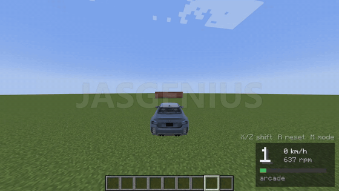

# Minecraft × BeamNG.drive

Drive real BeamNG.drive cars in Minecraft.



BeamNG runs the car in the background: physics, engine, gearbox, tyres and damage. Minecraft
draws it with the car's real model, bent every frame to match BeamNG's physics, so when you hit a
wall the front crumples right there in Minecraft. Minecraft's world goes the other way. BeamNG
gets your blocks as solid ground, so the car drives on your terrain, falls into the holes you dig,
parks in your garage and floods its engine if you drive it into the sea.

It also runs the other way round: Minecraft inside a BeamNG map, where you play Steve in BeamNG's
world and can climb on its cars, blow them up with TNT and get in and drive them.

Windows only, single player. Built by JASGENIUS with Claude Code.

## What you need

- Windows 10 or 11 and a GPU that can run both games at once
- [BeamNG.drive](https://store.steampowered.com/app/284160/BeamNGdrive/) from Steam (tested with 0.39.4)
- Minecraft: Java Edition (the mod runs Minecraft 1.21.1 with Fabric)
- Java 21. If you don't have it, `play.bat` offers to install it for you (Eclipse Temurin, through winget)

## Play

1. Download this repo (green **Code** button, **Download ZIP**, then unzip it) or `git clone` it.
2. Double-click **`play.bat`**.
3. Pick a mode:
   - **1** BeamNG cars in a flat Minecraft world. Start here.
   - **2** BeamNG cars on a normal Minecraft world.
   - **3** Minecraft inside BeamNG.

`play.bat` installs the BeamNG side, starts BeamNG, waits for it, then starts Minecraft, which opens
the right world by itself. The first start takes a few minutes: BeamNG sets up a fresh profile, and
Minecraft, Fabric and the shader mods download once. Later starts are quicker.

The crossover runs BeamNG on its own profile (the `bng-userfolder` folder it makes here), so your
normal BeamNG mods, settings and saves are never touched.

## Driving

Walk up to a car and right-click it (LB / L1 on a controller) with an empty hand to get in. Sneak
(Shift) gets you out. Controller buttons use Xbox names; on a PlayStation pad A is cross, B circle,
X square and Y triangle.

| Do | Keyboard | Controller |
|---|---|---|
| Throttle / brake (hold brake to reverse) | W / S | right / left trigger |
| Steer | A / D | left stick |
| Handbrake | Space | |
| Shift up / down | X / Z | X / A |
| Gearbox mode (arcade, realistic) | M | RB |
| Reset the car, repaired | R | Y |
| Repair (tap) / rewind (hold) | Backspace | View |
| Ignition and starter (hold) | V | LB |
| Horn / headlights | H / N | left stick click / D-pad up |
| ESC, traction control, drive mode | G | D-pad right |
| Look around | mouse | right stick |
| Get out | Shift | B / circle, or right stick click |

More keys:

- **B** opens the car picker: every car BeamNG has, with its versions and pictures. Pick one to swap
  the car you're in, or to put one in front of you.
- **F5** cycles the views, including the driver's seat.
- **O** opens the crossover settings: smooth or real-block ground, water, crash damage, dent
  strength, the chase camera, the dashboard.
- **J** shows or hides the controls list. All the car keys can be changed under Controls, "BeamNG car".

Things you can do to cars: TNT within a few metres blows one apart. Swords, axes and arrows dent
it and can pop a tyre. Flint and steel sets it on fire, a water bucket puts it out. The **Car
Remover** (Tools tab in creative) deletes a car. A moving car hits mobs and players, and a hard
crash hurts the driver (both can be turned off in the settings).

Shaders work: Sodium and Iris come with it, plus the Complementary Reimagined pack. Pick it under
Options, Video Settings, Shader Packs (**I** opens that menu, **K** turns shaders on and off).

## Your own maps

Any world saved in Minecraft 1.21.1 or earlier can be a driving map. Any world whose name ends in
`[BeamNG]` is one:

1. Copy the world's folder into `beamng\minecraft\run\saves` (it exists after the first start).
2. Rename the world so its name ends in `[BeamNG]`, for example `My City [BeamNG]`: in Minecraft's
   Singleplayer list, select it and press **Edit**.
3. Next time, run `play.bat terrain -World "folder name"` and it opens by itself.

BeamNG gets the ground within about 500 blocks of you and rebuilds it as you drive further. Cities
work: the crossover tells streets from roofs, finds the deck of an elevated road you're driving on,
and gives lamp posts and tree trunks their real size. Railings stick out about half a block further
in BeamNG than they look.

## Your own BeamNG car mods

```powershell
python beamng\scripts\mod_picker.py
```

opens a page on your PC listing the car mods in your normal BeamNG profile, with their pictures.
**Add to Minecraft** copies one into the crossover's profile, and the car picker (B) lists it.
Your normal profile is only read.

## Minecraft inside BeamNG

Mode 3 starts BeamNG's smallgrid map; `play.bat bridge -Level gridmap_v2` picks another. Steve
walks on BeamNG's real collision, and BeamNG's camera follows Minecraft's.

| Key | Does |
|---|---|
| Right-click a car (empty hand) | Get in and drive it in BeamNG; F4 gets you out next to it |
| F4 | Hand the keyboard and mouse to BeamNG (its menus, driving); F4 in BeamNG comes back |
| F6 | Minecraft's overlay window on or off |
| F7 | Camera: Minecraft drives BeamNG, Minecraft follows BeamNG, or off |
| F9 | Status display |

Minecraft is drawn over BeamNG's window in this mode, so it's always in front of BeamNG's world.

## If something's wrong

- **"BeamNG is running without the crossover mod"**: close BeamNG and run `play.bat` again.
- **A new car takes about 20 seconds to show up**: the first time a model is used, BeamNG converts
  its textures. After that it's quick.
- **Stutter**: Minecraft is capped at 120 fps on purpose, so BeamNG keeps enough of the GPU to run
  the physics smoothly.
- **Low frame rate on a laptop**: Minecraft may be running on the built-in graphics chip. In
  Windows' Settings, System, Display, Graphics, add the `java.exe` from your Java 21 folder (for
  example `C:\Program Files\Eclipse Adoptium\jdk-21...\bin\java.exe`) and set it to High performance.
- **Logs**: `beamng\scripts\logs.ps1` for BeamNG, `beamng\minecraft\run\logs\latest.log` for
  Minecraft. `beamng\scripts\diagnose.ps1` checks both games while they run.

## How it works

The two games talk over UDP on your own PC (127.0.0.1). A Fabric mod runs in Minecraft and a Lua
extension runs in BeamNG. When you get into a car, BeamNG's own exporter writes the car's model to
BeamNG's user folder, Minecraft loads it, and BeamNG streams the positions of the car's physics
nodes every frame; Minecraft bends the model to fit them. Minecraft sends its ground
back as boxes (flat world) or as a BeamNG terrain built from the Minecraft surface (normal world),
and patches it as blocks change.

[`beamng/README.md`](beamng/README.md) is the developer guide: the scripts, the tests, and the
docs on the protocol, the coordinates, every BeamNG call used, and the full build log.

## Credits

- [minecraft-crossover-bridge](https://github.com/justbustin/minecraft-crossover-bridge) by
  justbustin (Minecraft inside Monster Hunter: World and Elden Ring) is where this started, and
  parts of the code still come from it.
- BeamNG.drive by BeamNG GmbH, Minecraft by Mojang. No files from either game are in this repo
  (the docs have screenshots); the mod uses your own installs.
- Sodium, Iris, Controlify, YetAnotherConfigLib and Complementary Reimagined download from Modrinth
  when you first play (`beamng/THIRD_PARTY_NOTICES.md`).

Fan project, not affiliated with Mojang, Microsoft or BeamNG GmbH. Don't use it on BeamMP or any
online server. MIT licence, see [LICENSE](LICENSE).
